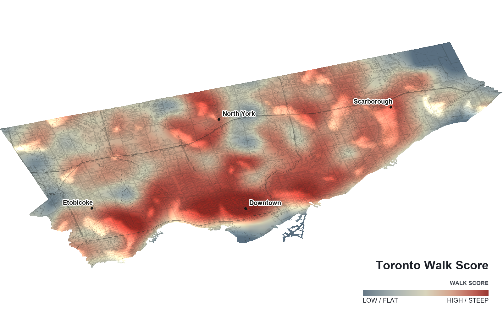
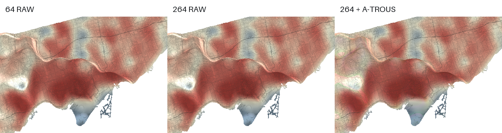

# Toronto Walk Score Forge3D

A controlled Forge3D render of Toronto's Walk Score surface, including fixed-sample checks for visible grain.



The repository contains the archived scraped scores, Toronto boundary, OpenStreetMap road export, input builder, publication renderer, and the fixed-sample diagnostic.

The diagnostic renders the same Toronto Walk Score surface three ways:

1. 64 fixed samples, no denoiser
2. 264 fixed samples, no denoiser
3. The 264-sample HDR result with A-Trous applied afterwards

The seed, camera, materials, lighting, and compositor stay fixed. Adaptive sampling is disabled so Forge3D cannot stop early.

## Rebuild the map

Install the verified Forge3D revision and the Python dependencies:

```bash
git clone https://github.com/milos-agathon/forge3d.git
git -C forge3d checkout f5db54f95d202681f95dad649162d18efdae8987
pip install -e forge3d
pip install -r requirements.txt
```

Rebuild the prepared terrain and texture from the archived scores, boundary, CARTO tiles, and OpenStreetMap roads:

```bash
python prepare_inputs.py
```

Render the labelled publication map with Forge3D's hybrid terrain path:

```bash
python render_map.py
```

Run the fixed-sample diagnostic:

```bash
python experiment.py
```

Forge3D uses Vulkan here. Override `WGPU_BACKEND` before running if your build needs another backend. `prepare_inputs.py` needs network access only for the CARTO basemap tiles; the archived score and road data are local.

Outputs are written to `output/`:

- `toronto-walk-score-forge3d.png`
- `render-metadata.json`
- `64-raw.png`
- `264-raw.png`
- `264-atrous.png`
- `comparison.png`
- `metrics.json`

## What this test can establish

If 64 and 264 raw samples look materially different, sampling noise is still a plausible cause. If they are nearly identical, sample count is unlikely to be the dominant cause.

The A-Trous pass is a separate ablation. It tests whether AOV-guided denoising removes the visible grain without smearing roads, boundaries, or colour transitions.



The checked-in run used seed 31. The 64- and 264-sample raw crops differed by 0.037/255 mean absolute error, while their roughness values were effectively identical. See [`metrics.json`](metrics.json) for the raw output.

This experiment narrows the fault. It does not identify it by itself. Material texture, HDR/albedo division, and nearest-neighbour reprojection remain separate suspects.

## Input

`data/toronto_walkscore_extended.csv` is the archived 796-point scrape, including page titles and source URLs. `data/boundary/` contains the official municipal boundary, and `data/gta_major_roads.json` contains the Overpass road export.

`toronto_inputs.npz` is the reproducible prepared fixture generated from those files. Run `scrape_walkscore.py` only when deliberately refreshing the archived scores; it replaces the CSV after at least 500 pages return valid scores.

See [`SOURCES.md`](SOURCES.md) for dates, attribution, software revision, and third-party data terms.
